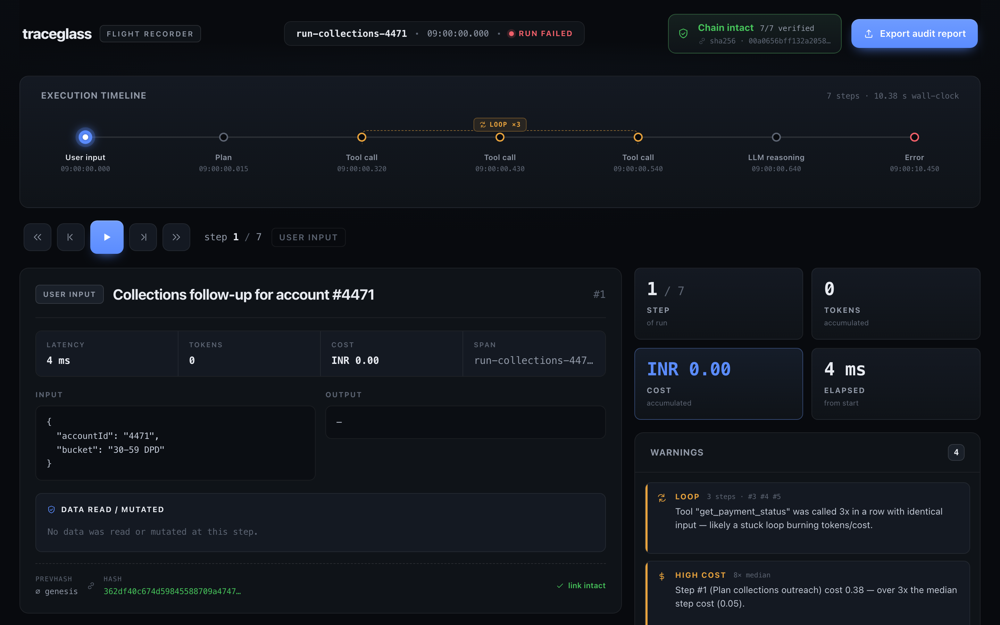
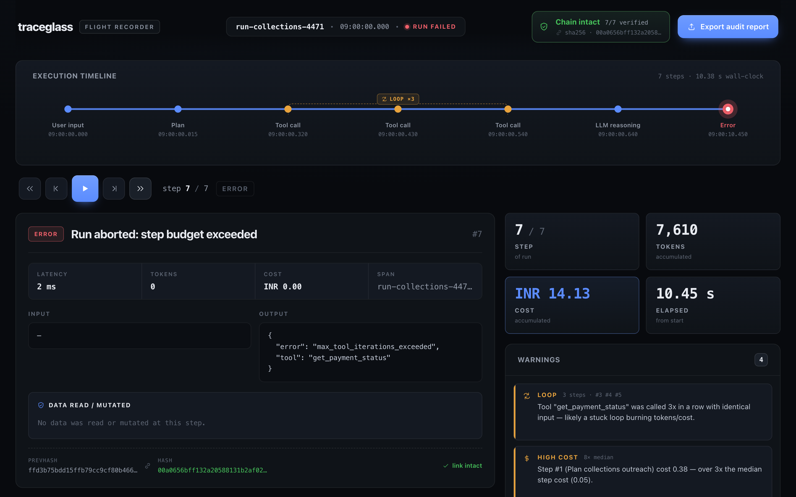

# traceglass

**A flight recorder for AI agents.** Tamper-evident, replayable audit for autonomous agents — built for teams that have to *prove* what their agents did.



```bash
npx traceglass demo
```

That boots a local dashboard on a bundled sample run — a collections agent stuck
in a tool loop — in about ten seconds, no input file required. Scrub it step by
step: every tool call, every token, every rupee, and exactly what data the agent
**read or mutated** — with a cryptographic guarantee that the record hasn't been
altered since it was captured. Point it at your own trace with
`npx traceglass open ./trace.json`.

| Step into the loop | Watch the run abort |
| :---: | :---: |
| [](docs/screenshots/step-loop.png) | [](docs/screenshots/step-error.png) |

---

## Why this exists

Autonomous agents are moving into regulated work — lending, collections, underwriting, healthcare, claims. When an agent declines a loan, duns the wrong account, or burns ₹14 of compute in a stuck loop, someone has to answer for it: a regulator, an auditor, an incident review, a customer.

A pile of JSON logs is not an answer. You need to **replay** what happened, show **what data was touched**, and prove the record is **the one that was captured** — not something edited after the fact.

traceglass turns an agent trace into that record:

- **Replayable** — step through the run on a timeline; watch cost and tokens climb; jump straight to the loop or the error.
- **Tamper-evident** — every step is hash-chained (SHA-256, each step over the previous). Change one field in storage and the dashboard turns **red** and names the first broken step.
- **Compliance-first** — each step surfaces the data it **read** or **mutated**, so "what did the agent see and change?" is answerable at a glance.
- **Cost- and loop-aware** — automatic detection of stuck tool loops and steps that cost far more than the run's norm.

## Local-first — your data never leaves your machine

This is a hard guarantee, not a setting:

- **No network egress.** traceglass makes **zero outbound network calls.** No telemetry, no analytics, no phone-home.
- **No account, no cloud, no API key.** Nothing to sign up for.
- **The dashboard binds to `127.0.0.1`** on an ephemeral port — it is not reachable from your network.
- **Your traces stay on disk** in a local append-only SQLite store (`~/.traceglass`). The bundled UI ships its own assets — no CDN fonts or scripts.

If your agent runs on sensitive financial or health data, that data can be loaded, replayed, and audited without a single byte going anywhere.

## Quick start

```bash
# Kick the tires on a bundled sample run — no input needed
npx traceglass demo

# Replay your own Claude Code sessions — pick one from the session picker
npx traceglass open

# List your Claude Code sessions, then replay one directly
npx traceglass sessions
npx traceglass open --session <sessionId>

# Replay your own trace file (ingests it, then opens the dashboard on 127.0.0.1)
npx traceglass open ./trace.json

# Verify a stored run's integrity from the terminal (exit 1 if tampered)
npx traceglass verify <runId>

# Write a standalone, portable HTML audit report
npx traceglass report <runId> -o audit.html

# List everything you've ingested
npx traceglass list
```

The `open` command always prints the dashboard URL, so it works over SSH or in
environments where a browser can't be launched automatically.

## Input formats

traceglass ingests three sources:

1. **Claude Code sessions** — point it at your `~/.claude/projects` session logs
   (`traceglass sessions` / `open --session <id>`, or just `traceglass open` for
   the session picker). Tool calls, tokens, real cost, and the data each tool
   read or returned are mapped onto the same replayable, hash-chained record.
2. **OpenTelemetry OTLP/JSON** traces — using `gen_ai.*` semantic conventions plus
   `traceglass.*` attributes for run/step metadata.
3. **Native traceglass JSON** — a compact `{ id, name, steps[] }` shape.

See [`fixtures/`](./fixtures) for runnable examples, including a clean
underwriting run, a collections agent stuck in a tool loop, and a sample Claude
Code session. The Claude Code adapter references [inspecto](https://www.npmjs.com/package/inspecto)
as its parse reference but takes no runtime dependency on it.

## How tamper-evidence works

Each step's hash is `SHA-256(canonical(step) + prevHash)`, where `canonical`
is a stable, sorted-key serialization of the step's content. The run's anchor
hash is the final step's hash. Re-hash the chain and compare: if any stored
step was altered, its hash no longer matches and verification points at the
**first** broken step. The store itself is **append-only** — there is no update
path through the application.

Run status (did the agent succeed or fail?) and integrity (is the record
authentic?) are deliberately shown as **separate axes**: a failed run with an
intact chain is a faithfully recorded failure; a tampered record is a different
problem entirely.

## Development

This is an npm-workspaces monorepo (Node ≥20, TypeScript, ESM):

- **`@traceglass/core`** — model (Zod), ingest (OTel + native + Claude Code
  sessions), analysis (loops, cost), integrity (hash chain), append-only store,
  HTML report.
- **`traceglass`** (`packages/cli`) — Fastify server + `commander` binary.
- **`@traceglass/web`** — React + Vite dashboard (bundled into the CLI on build).

```bash
npm install
npm run build
npm test          # 62 tests across ingest, analysis, integrity, store, report, server, web
```

## License

MIT — see [LICENSE](./LICENSE).
