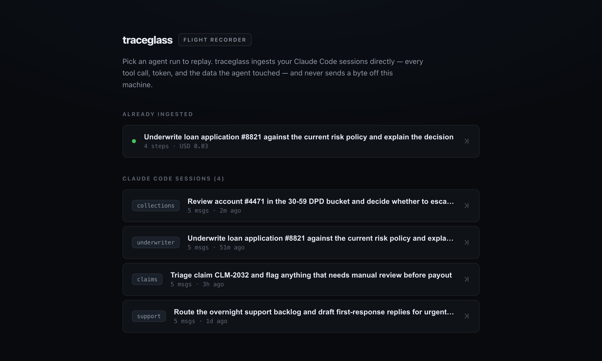

# traceglass

**A flight recorder for AI agents.** Tamper-evident, replayable audit for autonomous agents — built for teams that have to *prove* what their agents did.


```bash
npx traceglass demo
```

That boots a local dashboard on a bundled sample run — a collections agent stuck
in a tool loop — in about ten seconds, no input file required. Scrub it step by
step: every tool call, every token, every rupee, and exactly what data the agent
**read or mutated** — with a cryptographic guarantee that the record hasn't been
altered since it was captured. Point it at your own trace with
`npx traceglass open ./trace.json`.

| Step into the loop | Watch the run abort |
| :---: | :---: |
| [](docs/screenshots/step-loop.png) | [](docs/screenshots/step-error.png) |

### Replay your own Claude Code sessions

Run `npx traceglass open` with no arguments and traceglass scans your
`~/.claude/projects` logs and drops you on a **session picker** — choose any
agent run and replay it in the full dashboard above. Nothing leaves your machine.

[](docs/screenshots/session-picker.png)

---

## Why this exists

Autonomous agents are moving into regulated work — lending, collections, underwriting, healthcare, claims. When an agent declines a loan, duns the wrong account, or burns ₹14 of compute in a stuck loop, someone has to answer for it: a regulator, an auditor, an incident review, a customer.

A pile of JSON logs is not an answer. You need to **replay** what happened, show **what data was touched**, and prove the record is **the one that was captured** — not something edited after the fact.

traceglass turns an agent trace into that record:

- **Replayable** — step through the run on a timeline; watch cost and tokens climb; jump straight to the loop or the error.
- **Tamper-evident** — every step is hash-chained (SHA-256, each step over the previous). Change one field in storage and the dashboard turns **red** and names the first broken step.
- **Compliance-first** — each step surfaces the data it **read** or **mutated**, so "what did the agent see and change?" is answerable at a glance.

## Tail mode: watch a run while it happens (v0.7)

Everything above is forensics — after the fact. `traceglass tail` makes it
monitoring. Because the SDK appends each step to a journal *the moment it
happens*, the live stream already exists on disk; tail just follows it.

```console
$ traceglass tail
  ▸ tailing "live collections agent" (tail-1)

    0 user_input     Dun account 4471
    1 tool_call      Tool: get_payment_status INR 4.70 800tok
    2 tool_call      Tool: get_payment_status INR 4.70 800tok
    3 tool_call      Tool: get_payment_status INR 4.70 800tok
  ⚠ LOOP: Tool "get_payment_status" was called 3x in a row with identical input
    — likely a stuck loop burning tokens/cost.

  ● run completed — 5 steps, INR 14.10, 2400 tokens
    anchor 93b46ccf65ded070… · signed
```

The loop warning fires **mid-flight** — you see the agent burning money while
it is still burning it, not in tomorrow's audit. `traceglass tail --list` shows
what is currently recording.

The dashboard does the same: open `/?live=<runId>` and it polls the journal,
auto-following the newest step with a pulsing **Recording…** indicator, then
switches seamlessly to the sealed, signed record the moment the run finalizes.
A live run reports `status: "running"` with an empty `runHash` — the chain is
real up to the latest step, but the record is not yet anchored or signed.

Two endpoints back it: `GET /api/live` (what is recording now) and
`GET /api/live/:id` (the in-flight run, or the stored record once finalized).
- **Cost- and loop-aware** — automatic detection of stuck tool loops and steps that cost far more than the run's norm.

## Local-first — your data never leaves your machine

This is a hard guarantee, not a setting:

- **No network egress.** traceglass makes **zero outbound network calls.** No telemetry, no analytics, no phone-home.
- **No account, no cloud, no API key.** Nothing to sign up for.
- **The dashboard binds to `127.0.0.1`** on an ephemeral port — it is not reachable from your network.
- **Your traces stay on disk** in a local append-only SQLite store (`~/.traceglass`). The bundled UI ships its own assets — no CDN fonts or scripts.

If your agent runs on sensitive financial or health data, that data can be loaded, replayed, and audited without a single byte going anywhere.

## Quick start

```bash
# Kick the tires on a bundled sample run — no input needed
npx traceglass demo

# Replay your own Claude Code sessions — pick one from the session picker
npx traceglass open

# List your Claude Code sessions, then replay one directly
npx traceglass sessions
npx traceglass open --session <sessionId>

# Replay your own trace file (ingests it, then opens the dashboard on 127.0.0.1)
npx traceglass open ./trace.json

# Verify a stored run's integrity from the terminal (exit 1 if tampered)
npx traceglass verify <runId>

# Write a standalone, portable HTML audit report
npx traceglass report <runId> -o audit.html

# List everything you've ingested
npx traceglass list

# Sign new ingests with a local Ed25519 key (one-time setup)
npx traceglass keygen

# Export a run as a portable evidence file anyone can verify offline
npx traceglass export <runId> -o run.tgev
npx traceglass verify ./run.tgev   # works with no store, no keys, no network

# Run as a team collector: fixed port, bearer-token ingest API, retention
npx traceglass serve --port 4318 --token <token> --retain 180

# Assert what a run was ALLOWED to do (exit 1 on any violation — CI-ready)
npx traceglass check <runId-or-file> --policy policy.json --json

# Compare two runs — what changed, what regressed, where the cost moved
npx traceglass diff <baseline> <candidate> --fail-on-change

# Sweep every stored run: which agents ever touched this account?
npx traceglass search "4471"

# Auto-record every finished Claude Code session as signed, policy-checked evidence
npx traceglass watch --policy policy.json --anchor

# Irreversibly remove PII — the chain and signature still verify afterwards
npx traceglass redact <runId> --path input.ssn --pattern email --reason "erasure request" --yes

# Purge freed pages so removed values can't be read back out of the store file
npx traceglass vacuum

# Watch a run LIVE as it happens — steps, cost, and warnings stream in
npx traceglass tail
```

The `open` command always prints the dashboard URL, so it works over SSH or in
environments where a browser can't be launched automatically.

## Input formats

traceglass ingests three sources:

1. **Claude Code sessions** — point it at your `~/.claude/projects` session logs
   (`traceglass sessions` / `open --session <id>`, or just `traceglass open` for
   the session picker). Tool calls, tokens, real cost, and the data each tool
   read or returned are mapped onto the same replayable, hash-chained record.
2. **OpenTelemetry OTLP/JSON** traces — using `gen_ai.*` semantic conventions plus
   `traceglass.*` attributes for run/step metadata.
3. **Native traceglass JSON** — a compact `{ id, name, steps[] }` shape.

See [`fixtures/`](./fixtures) for runnable examples, including a clean
underwriting run, a collections agent stuck in a tool loop, and a sample Claude
Code session. The Claude Code adapter references [inspecto](https://www.npmjs.com/package/inspecto)
as its parse reference but takes no runtime dependency on it.

## How tamper-evidence works

Each step's hash is `SHA-256(canonical(step) + prevHash)`, where `canonical`
is a stable, sorted-key serialization of the step's content. The run's anchor
hash is the final step's hash. Re-hash the chain and compare: if any stored
step was altered, its hash no longer matches and verification points at the
**first** broken step. The store itself is **append-only** — there is no update
path through the application.

Run status (did the agent succeed or fail?) and integrity (is the record
authentic?) are deliberately shown as **separate axes**: a failed run with an
intact chain is a faithfully recorded failure; a tampered record is a different
problem entirely.

## Sign it, export it, prove it (v0.3)

The hash chain proves the record is *internally consistent* — but whoever can
edit the store can also re-chain it. v0.3 closes that hole:

- **Ed25519 signing** — after `traceglass keygen`, every ingested run's anchor
  is signed with a local key (private key never leaves `~/.traceglass/keys`,
  mode 0600). An attacker who re-chains a tampered record now fails signature
  verification — `verify` checks both axes.
- **Portable evidence** — `traceglass export <runId>` writes a single `.tgev`
  file containing the run, chain, signature, and public key. A regulator,
  customer, or incident reviewer runs `traceglass verify file.tgev` and gets a
  verdict **fully offline** — no store, no keys, no network. `report` renders
  the HTML audit report from the same file.
- **Anchoring** — `traceglass anchor --all` appends `{runId, runHash, signature}`
  records to a JSONL file you push to WORM storage (e.g. S3 Object Lock). On its
  own this is only as trustworthy as the machine that wrote it; see
  [external trust roots](#external-trust-roots-rfc-3161-and-sigstorerekor) for
  what turns it into evidence a third party can check.

## External trust roots: RFC 3161 and Sigstore/Rekor

### The problem this solves

`traceglass verify` checks a run's Ed25519 signature against **the public key
embedded in the evidence file itself**. That is a closed loop. An attacker who
controls the machine can edit a step, re-chain, generate a fresh keypair, re-sign,
embed the new public key — and the file verifies clean. Signing proves the record
is *internally consistent and self-attested*. It does **not** prove *"this is the
record the agent actually produced."*

For a regulator only the second claim is worth anything. Closing the gap means
binding the record to something **the operator cannot rewrite**.

| | An unanchored record proves | An anchored record adds |
|---|---|---|
| **Signed only** | internally consistent; self-attested by key `X` | — |
| **+ RFC 3161** | " | the record **existed by time T**, attested by a Time Stamping Authority. Post-hoc rewriting is defeated *even by someone holding your signing key*, because they cannot obtain a countersignature dated before the edit. |
| **+ Rekor** | " | membership in an **append-only public log**. Rewriting *and deletion* become detectable by third parties — "this record was deleted" turns into "this record is missing from a sequence". |

### Usage

Anchoring is opt-in per command. **The default sink makes no network request,
ever** — traceglass is local-first and this is a stated guarantee, enforced by a
test that fails if the default path so much as calls `fetch`.

```bash
# Default: local file, zero egress. Unchanged from previous releases.
traceglass anchor --all

# RFC 3161 — countersign the anchor with a Time Stamping Authority.
traceglass anchor --all --sink rfc3161 --tsa http://timestamp.digicert.com

# ...and pin the authority, which is what makes it third-party proof:
traceglass anchor --all --sink rfc3161 \
  --tsa http://timestamp.digicert.com --tsa-cert digicert-tsa.pem

# Sigstore/Rekor — append to a public transparency log. Permanent and public,
# so the consent flag is mandatory.
traceglass anchor --all --sink rekor \
  --rekor https://rekor.sigstore.dev --i-understand-public-log

# Check runs back against their anchors — offline.
traceglass anchor --verify
traceglass verify <runId> --anchors ~/.traceglass/anchors.jsonl --tsa-cert tsa.pem

# For CI: fail unless a real external trust root backs the record.
traceglass verify <runId> --anchors anchors.jsonl \
  --tsa-cert tsa.pem --require-external
```

### What actually leaves your machine

Only a **SHA-256 digest**, and only when you pass an explicit URL. Never
payloads, step labels, tool names, costs, or run ids.

The digest covers the *anchor statement* — a fixed line-based encoding of
`{runId, runHash, keyId, signature}`. Because the statement binds the run id and
signature, a timestamp token cannot be lifted from one record and presented for
another; that is checked and tested.

| Sink | Transmitted | Received back |
|---|---|---|
| `file` | *nothing* | — |
| `rfc3161` | request DER: version, algorithm OID, the digest, a nonce (~70 bytes) | a timestamp token |
| `rekor` | the digest, an Ed25519 signature over the statement, **and your Ed25519 public key** | log entry + inclusion proof |

**Be aware of the residual disclosure.** Submitting a hash to a public log
reveals *that a record exists* and *when* — and, via the public key, links every
entry you make with that key. It reveals nothing about the run's contents, but
existence-and-timing is itself metadata some users cannot leak. A Rekor entry is
also **permanent**: the log is append-only and entries cannot be retracted. That
is why `--sink rekor` refuses to run without `--i-understand-public-log`. If
that trade is wrong for you, RFC 3161 discloses strictly less (only the TSA sees
the digest) and still gives you the "existed by time T" property.

### Verification, and exactly how far it goes

Anchors are worthless if nothing ever reads them back. `verify --anchors` and
`anchor --verify` re-derive the anchor statement from the stored run and check
every proof against it, reporting one of four strengths:

- **`none`** — no anchor record exists. Reported, never passed over silently.
- **`local`** — a matching, chained, self-signed record, but no external proof.
- **`self-attested`** — the proof is cryptographically valid, but only against
  trust material carried *inside the proof itself*.
- **`external`** — the proof verifies against material you supplied out of band
  (`--tsa-cert` / `--rekor-key`). **Only this is third-party evidence.**

The `self-attested` / `external` distinction is deliberate and load-bearing.
Verifying a TSA token against the certificate embedded in that same token is the
identical closed loop as verifying a run against its own embedded key — so it is
never reported as proof. Likewise a Rekor inclusion proof without the log's
public key is self-referential (an attacker who fabricates the entry fabricates a
matching root), so `--rekor-key` is what upgrades it.

**What is not implemented:** X.509 path building to a trusted root. Node exposes
no chain verifier, and a half-built one would be worse than an honest gap. Pin
the TSA certificate instead. Full certificate-chain validation and key
rotation/revocation remain open (see `ROADMAP.md`).

The anchors file itself is now chained — each record stores the SHA-256 of the
preceding line — and each record is Ed25519-signed. Deleting, reordering, or
hand-writing a line is detected. This does not stop an attacker who has stolen
your signing key; nothing local can. It stops one who only has file write
access, which previously was enough to forge a clean anchor.

### Dependencies

**Zero new dependencies.** The production dependency count is unchanged at four.

RFC 3161 needs ASN.1/DER, and the npm options (`pkijs`+`asn1js`, `node-forge`)
each add several thousand lines and a transitive tree to a product whose pitch is
that you can audit its supply chain. What RFC 3161 actually requires is a
five-field request and a walk through CMS `SignedData` — a few hundred bytes of
structure — so `src/asn1.ts` implements exactly that slice and nothing more.
X.509 parsing uses Node's built-in `X509Certificate`; all crypto is Node's
`node:crypto`. `npm audit --omit=dev` stays at 0 vulnerabilities.

### How this is tested

Every anchoring test runs **offline**, with no network and no skip-if-unavailable
path. Beyond synthetic cases, the suite runs against real-world artefacts
captured from production services and committed to `packages/cli/test-fixtures`:

- **Genuine RFC 3161 tokens** from DigiCert's and Sectigo's public TSAs, plus
  OpenSSL's own TSA implementation — covering multi-certificate chains and
  differing signature-algorithm encodings that our own encoder cannot produce.
- **A real Sigstore log entry**, verified by recomputing the public log's
  published Merkle root from its 31-node inclusion path in a tree of ~2.1 billion
  entries, and by checking its Signed Entry Timestamp against Rekor's real
  public key.
- The Merkle implementation is additionally cross-checked against a second,
  independent implementation transcribed from the recursive definitions in
  RFC 9162, so agreement is evidence rather than tautology.
- Every single-bit flip across a token's signed regions is required to be
  detected — exhaustively, not sampled.

## Record runs live with the SDK

Post-hoc ingestion leaves a window between "agent ran" and "trace ingested."
[`@traceglass/sdk`](./packages/sdk) closes it: each step is hash-chained and
journaled to disk **the moment it happens**, so recorded history can't be
reordered or edited afterward.

```ts
import { startRecording } from '@traceglass/sdk';

const rec = startRecording({ name: 'collections agent', currency: 'INR' });
rec.step({ type: 'user_input', label: 'Dun account 4471' });
rec.step({ type: 'tool_call', toolName: 'get_payment_status', label: 'Tool: get_payment_status',
           output: status, dataPayload: status, tokens: 812, cost: 0.4 });
const run = await rec.end(); // verified, signed, stored — replay with `traceglass open --id`
```

If the process crashes mid-run, `traceglass recover` finalizes the journal into
a `failed` run whose chain still verifies up to the crash point.

## Record what you already run: MCP and OpenTelemetry

The SDK asks you to write recording calls. These two adapters don't — they record
the tool calls and spans your agent already produces, with the same guarantee:
each step hash-chained and journaled at the moment it happens.

**[`@traceglass/mcp`](./packages/mcp)** — one MCP session becomes one signed run.
Wrap the client and every `tools/call` it makes is recorded; wrap a handler and
every call your server serves is:

```ts
import { startMcpRecording } from '@traceglass/mcp';

const rec = startMcpRecording({ name: 'support agent — ticket 8812' });
const mcp = rec.wrapClient(client); // your @modelcontextprotocol/sdk Client

await mcp.callTool({ name: 'lookup_order', arguments: { id: '4471' } });
const run = await rec.end(); // verified, signed, stored
```

Tool name, arguments, the full result, `structuredContent` as the compliance-critical
`dataPayload`, and timing land on the step; `isError: true` and thrown transport
errors become `error` steps, so a failed run records as failed.

**[`@traceglass/otel`](./packages/otel)** — if you already emit `gen_ai.*` spans,
a span processor is the whole integration:

```ts
const provider = new NodeTracerProvider({
  spanProcessors: [new TraceglassSpanProcessor({ currency: 'INR' })],
});
```

One trace becomes one run (`otel-<traceId>`), finalized when its root span ends.
It reads the **same attributes** as the offline OTLP ingester, so a span records
identically whether it arrives live or through `traceglass ingest`, and it keeps the
real `spanId`/`parentSpanId` so a step points back at the span it came from.

Neither adapter takes a production dependency on the MCP or OpenTelemetry SDKs:
both are structurally typed against those interfaces (asserted at compile time),
so they run against whatever version you already have and the supply chain behind
an audit record does not grow.

## Team collector mode

`traceglass serve` turns the same binary into a self-hosted collector: a fixed
port, `POST /api/ingest` (native or OTLP/JSON, auto-detected) and an
OTLP/HTTP-compatible `POST /v1/traces`, bearer-token auth on every write
(timing-safe compare), and optional retention (`--retain <days>`) whose
deletions are the store's **only** delete path and are audit-logged to
`~/.traceglass/audit.jsonl`. Binding a non-loopback host without a token is
refused outright — the local-first guarantee doesn't quietly degrade.

### Collector limits

An open ingest port is a DoS surface, and an unbounded body limit lets one
client pin the process. Both are capped, and both are explicit:

| Limit | Default | Override |
| --- | --- | --- |
| Request body | **32 MiB** | `--body-limit <MiB>` / `TRACEGLASS_BODY_LIMIT` |
| Ingest rate | **120 requests/min per client** | `--rate-limit <n>` / `TRACEGLASS_RATE_LIMIT` (`0` disables) |

32 MiB rather than Fastify's 1 MB default because real traces are not small — a
long Claude Code session with tool outputs runs to several MB, and an OTLP
exporter batching a whole agent run routinely passes 10 MB. At 1 MB a legitimate
trace fails at the parser with no explanation. An over-limit request is refused
from its declared `Content-Length` before a byte is buffered, and answered with
**413** naming the limit and the flag; chunked uploads that declare no length
hit the parser backstop and get the same 413.

120 ingests/min is generous for the workload — an agent that takes minutes to
run posts once — while stopping an unbounded POST loop. Over the limit you get
**429** with `Retry-After` and `X-RateLimit-*` headers. The counter is per
client IP over a fixed one-minute window, applied only to the routes that accept
trace data (`POST /api/ingest`, `POST /v1/traces`, `POST /api/sessions/:id/ingest`)
and keyed off the route Fastify matched, so a percent-encoded path lands in the
same bucket. Reads are never throttled: a misbehaving collector must not blind
the dashboard someone is using to look at the runs already stored.

The limiter is in-process by design rather than a plugin dependency — traceglass
ships four production dependencies precisely because it asks you to trust its
supply chain with an audit record. The trade is honest: the window is per
process, so a horizontally scaled deployment limits per instance, and the
counters reset on restart. Put a real gateway in front if you need more.

## Governance: policies, approvals, search (v0.4)

Recording what an agent did is half the job; the other half is asserting what
it was **allowed** to do.

- **Guardrail policies** — a plain JSON file of rules, checked against the
  evidence with `traceglass check` (works on stored runs *and* exported `.tgev`
  files, so a reviewer can police a record they received offline):

  ```json
  {
    "name": "payments guardrails",
    "rules": {
      "maxCostPerRun": 50,
      "maxCostPerStep": 5,
      "forbidTools": ["*_delete"],
      "requireApprovalFor": ["payments.*"],
      "requireSignature": true,
      "forbidWarnings": ["loop"]
    }
  }
  ```

  Integrity is checked alongside the rules — a policy verdict is only issued
  over an authentic record. `--json` (also on `verify`) makes both commands
  CI gates: wire `traceglass check` into a pipeline and a run that called
  `payments.refund` without sign-off fails the build.

- **Approval steps** — `approval` is a first-class step type: record who
  signed off on what (via the SDK or any ingest source), and
  `requireApprovalFor` enforces that sensitive tools fire only *after* an
  approval step. "Show me an agent action nobody approved" is now a query,
  not an archaeology project.

- **Cross-run search** — `traceglass search <text>` (and `GET /api/search`)
  sweeps every stored run's labels, tool names, and payloads. "Which runs
  ever touched account 4471?" — the shape of a GDPR data-subject request or
  an incident sweep — is one command.

- **Compliance summary in reports** — every HTML audit report now leads with
  the questions an auditor asks first: is the record authentic (signature),
  is the event log complete (hash chain + anchor), who approved what (human
  oversight), and what data was read or mutated.

## Watch mode: continuous governance for Claude Code (v0.5)

Your coding agents already leave session logs; `traceglass watch` turns them
into evidence without anyone lifting a finger:

```bash
npx traceglass keygen          # once
npx traceglass watch --policy coding-policy.json --anchor
```

Every finished Claude Code session (settled for `--settle` seconds, default
60) is automatically ingested, hash-chained, **signed**, checked against your
policy, and **anchored** — and policy violations are written to the audit log.
A rule like:

```json
{ "rules": { "forbidInputText": [".env", "rm -rf"], "forbidTools": ["WebFetch"] } }
```

means "an agent that touched a secrets file, ran a destructive command, or
reached for the network gets flagged the moment its session ends." Run
`traceglass watch --once` from cron or CI instead of the daemon — it exits 1
if any new session violated policy. Nothing leaves the machine either way.

## Redaction: erase the data, keep the proof (v0.6)

GDPR says minimise and delete; EU AI Act Article 12 says keep a complete,
tamper-evident log. Those pull in opposite directions — deleting a value from a
hash-chained record normally destroys the chain. traceglass resolves it.

Every payload leaf is committed to at capture time with a salted hash, and the
**step hash covers those commitments rather than the raw values**. Redacting a
leaf therefore destroys the value and its salt while leaving the hash — and the
signature — untouched:

```bash
npx traceglass redact <runId> --path input.ssn --pattern email --reason "erasure request"
#   dry run by default: shows exactly what would go
npx traceglass redact <runId> --path input.ssn --yes
#   Redacted 2 value(s)
#   Integrity anchor UNCHANGED (6e7ba959…) — the chain and signature still verify.
```

- **The value is genuinely gone.** Destroying the salt is what makes it
  irreversible: without it, a low-entropy value (an SSN, a boolean) could be
  brute-forced straight out of its commitment.
- **Siblings stay verifiable.** Redacting `input.ssn` leaves `input.account`
  independently checkable against its own commitment.
- **Tampering is still caught.** Because raw values no longer move the hash,
  verification checks every visible leaf against its commitment — edit one and
  `verify` fails, naming the exact path.
- **Auto-scrub at capture.** `startRecording({ redactPatterns: ['email','ssn'] })`
  replaces matches *before* anything is hashed or written, so the original never
  reaches disk. Built-in detectors: email, credit-card, ssn, aadhaar,
  private-key, bearer-token.
- **Pre-0.6 records** hashed raw values and can't be redacted this way. They
  have an explicit `--legacy` path that re-chains and re-signs — the report and
  CLI both state plainly that this yields a *new* anchor and a weaker guarantee.

The audit report discloses every redaction (path, reason, who, when) under
**Data minimisation**, so "what was removed, and is this record still intact?"
is answerable at a glance.

### Erasure has to hold against the file, not just the query

Removing a value from a row is not the same as removing it from the database
file. SQLite leaves freed pages byte-for-byte intact unless told otherwise, and
in WAL mode the superseded row survives until the next checkpoint — so on
traceglass 0.6.0–0.7.0 a value you had just been told was irreversibly removed
came straight back out of `strings ~/.traceglass/traceglass.sqlite`.

Since v0.7.1 the store runs with `secure_delete` on and follows every redaction
and retention prune with a checkpoint and a `VACUUM`. v0.8 closes the rest of
the gap:

```bash
npx traceglass vacuum
#   Vacuumed /Users/you/.traceglass/traceglass.sqlite
#     schema version: 1
#     runs kept:      42 (vacuum never removes a run)
#     file size:      8.4 MiB → 6.1 MiB (2.3 MiB reclaimed)
```

- **Existing databases are swept once, automatically.** A store written before
  the fix is stamped at schema version 0; opening it with v0.8 purges the
  residue and stamps it version 1. It does **not** vacuum on every open — that
  would be a serious regression on a large store.
- **`vacuum` is the manual lever.** Run it after restoring a backup, before
  handing a copy of the file to anyone, or any time you want the sweep now. It
  changes no logical row, is safe to run repeatedly, and reports what it
  reclaimed.
- **Verify it yourself.** `strings traceglass.sqlite | grep -c <value>` counts
  matching *lines*, not occurrences, and will mislead you; use
  `strings -a traceglass.sqlite | grep -o <value> | wc -l`, and check the
  `-wal` and `-shm` sidecars too.

### Schema versioning

The store records its schema in `PRAGMA user_version` and migrates forward one
recorded step at a time on open. A database written by a **newer** traceglass is
refused with a clear error rather than opened and corrupted — nothing is
modified, so the newer binary still reads it fine. Migrations may reshape
storage but never bypass the append-only invariant: `pruneOlderThan` remains the
only delete path and `replaceRedacted` the only update path.

```bash
docker build -t traceglass .
docker run -p 127.0.0.1:4318:4318 -v traceglass-data:/data \
  -e TRACEGLASS_TOKEN=change-me traceglass
```

## Development

This is an npm-workspaces monorepo (Node ≥20, TypeScript, ESM):

- **`@traceglass/core`** — model (Zod), ingest (OTel + native + Claude Code
  sessions), analysis (loops, cost), integrity (hash chain), append-only store,
  HTML report.
- **`@traceglass/sdk`** — live-capture recorder (chain fixed at capture time).
- **`@traceglass/mcp`** — MCP adapter: wraps a client or a tool handler so every
  `tools/call` is recorded. No dependency on the MCP SDK.
- **`@traceglass/otel`** — OpenTelemetry span processor: one trace per run, same
  attribute mapping as the OTLP ingester. No dependency on `@opentelemetry/*`.
- **`traceglass`** (`packages/cli`) — Fastify server/collector + `commander` binary.
- **`@traceglass/web`** — React + Vite dashboard (bundled into the CLI on build).

```bash
npm install
npm run build
npm test                    # 160+ tests across ingest, analysis, integrity, signing, redaction, policy, store, sdk, server, e2e
node scripts/e2e-check.mjs  # outcome check against the real built CLI
```

## License

MIT — see [LICENSE](./LICENSE).
